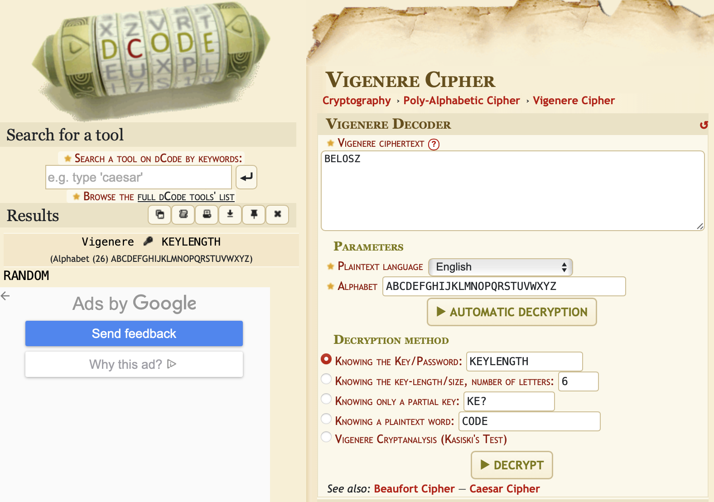
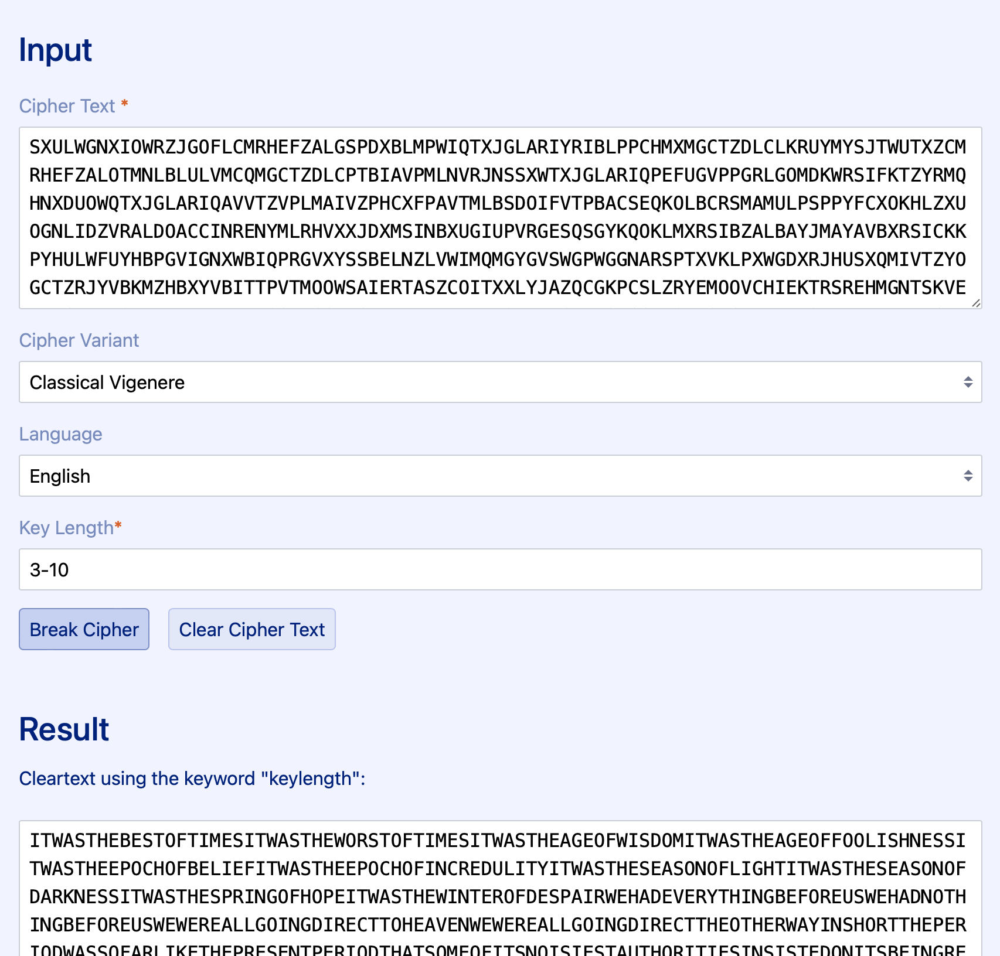

# Krypton 5


## Overview

-----------------
On the OverTheWire/Leviathan website, we are told how connecting to the bandit server as a specific user works.

Each user corresponds to a different level:
- Krypton0 -> Level 0
- Krypton1 -> Level 1
- ...
- Krypton33 -> Level 33

Each level is hiding a flag, which is used as the password for the following level. Meaning, one must solve `Level n` to play `Level n+1`.

We always start out connecting to the `krypton.labs.overthewire.org` server on `port 2231` for each level.
Again, the users on the server specifies the level. Each starting point is the same:

``` text
➜  ~  ssh krypton4@krypton.labs.overthewire.org -p 2231
                      _                     _              
                     | | ___ __ _   _ _ __ | |_ ___  _ __  
                     | |/ / '__| | | | '_ \| __/ _ \| '_ \ 
                     |   <| |  | |_| | |_) | || (_) | | | |
                     |_|\_\_|   \__, | .__/ \__\___/|_| |_|
                                |___/|_|                   

                      This is an OverTheWire game server. 
            More information on http://www.overthewire.org/wargames

krypton4@krypton.labs.overthewire.org's password: 
```

The password will always be the flag of the previous level. With the exception of Level 0, where the password is `KRYPTONISGREAT`.


## Connecting

--------------

We can establish a connection with the server via ssh, and using the password `CLEARTEXT`:

``` text
➜  ~  ssh krypton5@krypton.labs.overthewire.org -p 2231
                      _                     _              
                     | | ___ __ _   _ _ __ | |_ ___  _ __  
                     | |/ / '__| | | | '_ \| __/ _ \| '_ \ 
                     |   <| |  | |_| | |_) | || (_) | | | |
                     |_|\_\_|   \__, | .__/ \__\___/|_| |_|
                                |___/|_|                   

                      This is an OverTheWire game server. 
            More information on http://www.overthewire.org/wargames

krypton5@krypton.labs.overthewire.org's password: CLEARTEXT

      ,----..            ,----,          .---.
     /   /   \         ,/   .`|         /. ./|
    /   .     :      ,`   .'  :     .--'.  ' ;
   .   /   ;.  \   ;    ;     /    /__./ \ : |
  .   ;   /  ` ; .'___,/    ,' .--'.  '   \' .
  ;   |  ; \ ; | |    :     | /___/ \ |    ' '
  |   :  | ; | ' ;    |.';  ; ;   \  \;      :
  .   |  ' ' ' : `----'  |  |  \   ;  `      |
  '   ;  \; /  |     '   :  ;   .   \    .\  ;
   \   \  ',  /      |   |  '    \   \   ' \ |
    ;   :    /       '   :  |     :   '  |--"
     \   \ .'        ;   |.'       \   \ ;
  www. `---` ver     '---' he       '---" ire.org


Welcome to OverTheWire!

<snip>

  Enjoy your stay!

krypton5@gibson:~$ 
```

## Looking Around

--------------
We first start by looking around the home directory, as we have no idea what is going on. We will use the command `ls`,
which allows us to `list` the content of the current directory (or specified directory).


``` text
krypton5@bandit:~$ cd /krypton/krypton5
krypton5@bandit:/krypton/krypton5$ ls
found1  found2  found3  krypton6  README
krypton5@bandit:/krypton/krypton5$ cat README 
Frequency analysis can break a known key length as well.  Lets try one
last polyalphabetic cipher, but this time the key length is unknown.


Enjoy.
```

Okay, we can use the same concept as the last level, where we simply use an online solver: **https://www.guballa.de/vigenere-solver**




We use `found1` again to find the key: `KEYLENGTH`



And then we use the found key to decrypt the `krypton6` file.

The password for the next level is `RANDOM`.

