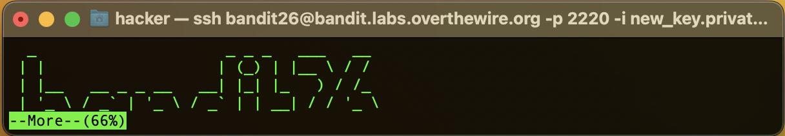
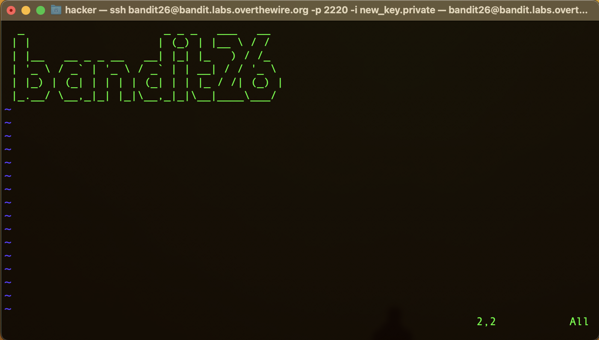
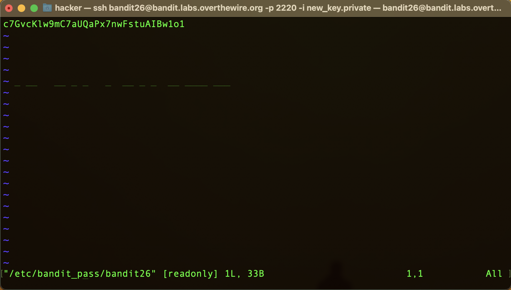
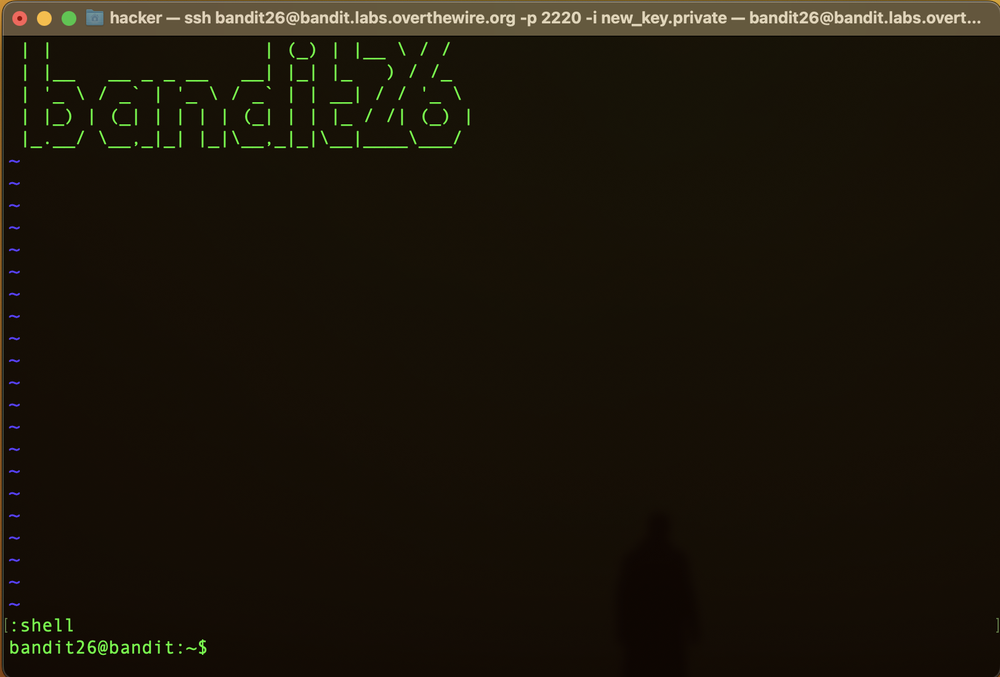

# Bandit 24

### Content
- **[Overview](#Overview)**
- **[Connecting](#Connecting)**
- **[Looking Around](#Looking-Around)**


## Overview

-----------------
On the OverTheWire/Bandit website, we are told how connecting to the bandit server as a specific user works.

Each user corresponds to a different level:
- Bandit0 -> Level 0
- Bandit1 -> Level 1
- ...
- Bandit33 -> Level 33

Each level is hiding a flag, which is used as the password for the following level. Meaning, one must solve `Level n` to play `Level n+1`.

We always start out connecting to the `bandit.labs.overthewire.org` server on `port 2220` for each level.
Again, the users on the server specifies the level. Each starting point is the same:

``` commandline
┌──(francis㉿ghost)-[~]
└─$ ssh bandit{level}@bandit.labs.overthewire.org -p 2220
                         _                     _ _ _   
                        | |__   __ _ _ __   __| (_) |_ 
                        | '_ \ / _` | '_ \ / _` | | __|
                        | |_) | (_| | | | | (_| | | |_ 
                        |_.__/ \__,_|_| |_|\__,_|_|\__|
                                                       

                      This is an OverTheWire game server. 
            More information on http://www.overthewire.org/wargames

bandit{level}@bandit.labs.overthewire.org's password: 
```

The password will always be the flag of the previous level.


## Connecting

--------------

We can establish a connection with the server via ssh, and using the password `p7TaowMYrmu23Ol8hiZh9UvD0O9hpx8d`:

``` commandline
┌──(francis㉿ghost)-[~]
└─$ ssh bandit25@bandit.labs.overthewire.org -p 2220
                         _                     _ _ _   
                        | |__   __ _ _ __   __| (_) |_ 
                        | '_ \ / _` | '_ \ / _` | | __|
                        | |_) | (_| | | | | (_| | | |_ 
                        |_.__/ \__,_|_| |_|\__,_|_|\__|
                                                       

                      This is an OverTheWire game server. 
            More information on http://www.overthewire.org/wargames

bandit25@bandit.labs.overthewire.org's password: p7TaowMYrmu23Ol8hiZh9UvD0O9hpx8d


      ,----..            ,----,          .---.
     /   /   \         ,/   .`|         /. ./|
    /   .     :      ,`   .'  :     .--'.  ' ;
   .   /   ;.  \   ;    ;     /    /__./ \ : |
  .   ;   /  ` ; .'___,/    ,' .--'.  '   \' .
  ;   |  ; \ ; | |    :     | /___/ \ |    ' '
  |   :  | ; | ' ;    |.';  ; ;   \  \;      :
  .   |  ' ' ' : `----'  |  |  \   ;  `      |
  '   ;  \; /  |     '   :  ;   .   \    .\  ;
   \   \  ',  /      |   |  '    \   \   ' \ |
    ;   :    /       '   :  |     :   '  |--"
     \   \ .'        ;   |.'       \   \ ;
  www. `---` ver     '---' he       '---" ire.org


Welcome to OverTheWire!

<snip>

bandit25@bandit:~$ 
```

## Task

--------------

Logging in to bandit26 from bandit25 should be fairly easy… The shell for user bandit26 is not /bin/bash, but something else. 
Find out what it is, how it works and how to break out of it.

## Looking Around

--------------
We first start by looking around the home directory, as we have no idea what is going on. We will use the command `ls`,
which allows us to `list` the content of the current directory (or specified directory).

``` text
bandit25@bandit:~$ ls
bandit26.sshkey
bandit25@bandit:~$ 
```

Based on the task, we can connect to the `bandit26` user from our current shell using the `sshkey`.

``` commandline
bandit25@bandit:~$ ssh bandit26@bandit.labs.overthewire.org -p 2220 -i bandit26.sshkey 
The authenticity of host '[bandit.labs.overthewire.org]:2220 ([127.0.0.1]:2220)' can't be established.
ED25519 key fingerprint is SHA256:C2ihUBV7ihnV1wUXRb4RrEcLfXC5CXlhmAAM/urerLY.
This key is not known by any other names
Are you sure you want to continue connecting (yes/no/[fingerprint])? yes
Could not create directory '/home/bandit25/.ssh' (Permission denied).
Failed to add the host to the list of known hosts (/home/bandit25/.ssh/known_hosts).
                         _                     _ _ _   
                        | |__   __ _ _ __   __| (_) |_ 
                        | '_ \ / _` | '_ \ / _` | | __|
                        | |_) | (_| | | | | (_| | | |_ 
                        |_.__/ \__,_|_| |_|\__,_|_|\__|
                                                       

                      This is an OverTheWire game server. 
            More information on http://www.overthewire.org/wargames

!!! You are trying to log into this SSH server with a password on port 2220 from localhost.
!!! Connecting from localhost is blocked to conserve resources.
!!! Please log out and log in again.


      ,----..            ,----,          .---.
     /   /   \         ,/   .`|         /. ./|
    /   .     :      ,`   .'  :     .--'.  ' ;
   .   /   ;.  \   ;    ;     /    /__./ \ : |
  .   ;   /  ` ; .'___,/    ,' .--'.  '   \' .
  ;   |  ; \ ; | |    :     | /___/ \ |    ' '
  |   :  | ; | ' ;    |.';  ; ;   \  \;      :
  .   |  ' ' ' : `----'  |  |  \   ;  `      |
  '   ;  \; /  |     '   :  ;   .   \    .\  ;
   \   \  ',  /      |   |  '    \   \   ' \ |
    ;   :    /       '   :  |     :   '  |--"
     \   \ .'        ;   |.'       \   \ ;
  www. `---` ver     '---' he       '---" ire.org


Welcome to OverTheWire!

<snip>

  Enjoy your stay!

  _                     _ _ _   ___   __  
 | |                   | (_) | |__ \ / /  
 | |__   __ _ _ __   __| |_| |_   ) / /_  
 | '_ \ / _` | '_ \ / _` | | __| / / '_ \ 
 | |_) | (_| | | | | (_| | | |_ / /| (_) |
 |_.__/ \__,_|_| |_|\__,_|_|\__|____\___/ 
Connection to bandit.labs.overthewire.org closed.
bandit25@bandit:~$
```

Alright. We immediately get kicked off. This is not good. 


## LOOKING UP ANSWER

Yes, how shameful. I looked up the answer. But to be fair, this level is really a "think outside the box" kind of level.

We first need to understand one thing about the `UNIX-based system`: The file `/etc/passwd`.


``` text
bandit25@bandit:~$ cat /etc/passwd
root:x:0:0:root:/root:/bin/bash
daemon:x:1:1:daemon:/usr/sbin:/usr/sbin/nologin
bin:x:2:2:bin:/bin:/usr/sbin/nologin
sys:x:3:3:sys:/dev:/usr/sbin/nologin
sync:x:4:65534:sync:/bin:/bin/sync
games:x:5:60:games:/usr/games:/usr/sbin/nologin
man:x:6:12:man:/var/cache/man:/usr/sbin/nologin
...
<snip>
...
krypton2:x:8002:8002:krypton level 2:/home/krypton2:/bin/bash
krypton3:x:8003:8003:krypton level 3:/home/krypton3:/bin/bash
krypton4:x:8004:8004:krypton level 4:/home/krypton4:/bin/bash
krypton5:x:8005:8005:krypton level 5:/home/krypton5:/bin/bash
krypton6:x:8006:8006:krypton level 6:/home/krypton6:/bin/bash
krypton7:x:8007:8007:krypton level 7:/home/krypton7:/bin/bash
bandit25@bandit:~$ 
```

What does this tell us?

The `/ect/passwd` file is a `text-based` database, which describes basic attributes of each user in a `UNIX-based` system
like Linux. It is readable by all users but only editable by the `root` user. Since it is a `text-based` database, there
is a specific structure to the file:

1) **Username** - Name of user.
2) **Password Placeholder** - Historically, this field contained the encrypted password, but for security reasons, it's usually just a placeholder (x) now. Actual passwords are stored in a separate shadow file.
3) **User ID** - The numerical ID assigned to user.
4) **Group ID** - The numerical ID of the group to which the user belongs.
5) **User Info** - This field is usually a brief description of the user. It is sometimes called the GECOS field.
6) **Home Directory** - The absolute path to the user's home directory.
7) **Login Shell** - The shell that is started whenever the user logs into the system.

Using the user `bandit26` we can assert: `bandit26:x:11026:11026:bandit level 26:/home/bandit26:/usr/bin/showtext`

1) bandit26
2) x
3) 11026
4) 11026
5) bandit level 26
6) /home/bandit26
7) /usr/bin/showtext

Everything seems straight forward, except the `/usr/bin/showtext` part. What the hell is that?
Let's try to figure it out.


``` text
bandit25@bandit:~$ cat /usr/bin/showtext
#!/bin/sh

export TERM=linux

exec more ~/text.txt
exit 0
```

Interesting. So apparently, whenever we start the server, we get are executing `more ~/text/txt` and then `exit 0` the
server. 

There is an interesting functionality associated with the `more` command. Namely, running the `vim` editor from it by pressing
the `v` key. But this only works if we are still going to display some of the text later on. Because the way `more` works
is that, the second you have displayed the whole file, we exit the `more` command and go back to our OG shell. Meaning,
we exit the server.

#### OUTSIDE THE BOX THINKING

What if we just shrink our terminal window when we login to `bandit26`, so `more` can't display the fill `bandit26` banner?




Okay... let's press the `v` key and let's see what happens...




Now, using the `:e /etc/bandit_pass/bandit26` command in `vim` we can switch to the password file for `bandit26` and view it.





Okay cool. Now we have the password file for the current level, but this only makes us not need the `sshkey` anymore. 
What we need to do is **break out** of the shell and be able to interact with the files. 

`vim` has a built-in shell feature which we can call using `:shell`, however, once we do that we get sent back to the 
stupid text-based shell and we get kicked out again.

We must force a change to which shell `vim` is going to be using, which can be accomplished using `:set shell=/bin/bash`.
Now if we type `:shell` we get this:





``` text
bandit26@bandit:~$ ls
bandit27-do  text.txt
bandit26@bandit:~$ ./bandit27-do 
Run a command as another user.
  Example: ./bandit27-do id
```

Now, we check what's inside the home directory. We can see there's a `bandit27-do` which just escalates our privilege to
being `bandit27` user so we can execute some commands. 

Let's print out the password for `bandit27`.

``` text
bandit26@bandit:~$ ./bandit27-do cat /etc/bandit_pass/bandit27
YnQpBuifNMas1hcUFk70ZmqkhUU2EuaS
```

Boom we got the flag for `bandit27`.
