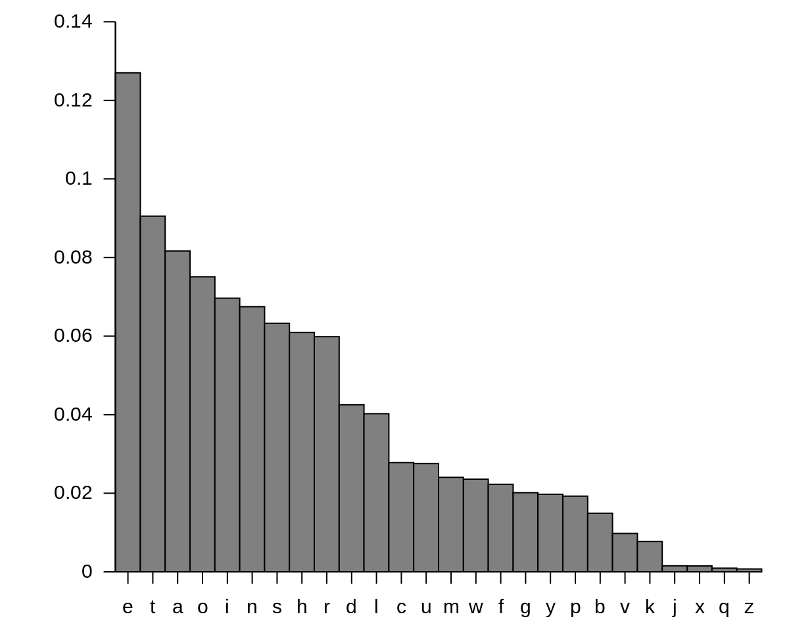

# Krypton 3


## Overview

-----------------
On the OverTheWire/Leviathan website, we are told how connecting to the bandit server as a specific user works.

Each user corresponds to a different level:
- Krypton0 -> Level 0
- Krypton1 -> Level 1
- ...
- Krypton33 -> Level 33

Each level is hiding a flag, which is used as the password for the following level. Meaning, one must solve `Level n` to play `Level n+1`.

We always start out connecting to the `krypton.labs.overthewire.org` server on `port 2231` for each level.
Again, the users on the server specifies the level. Each starting point is the same:

``` text
➜  ~  ssh krypton3@krypton.labs.overthewire.org -p 2231
                      _                     _              
                     | | ___ __ _   _ _ __ | |_ ___  _ __  
                     | |/ / '__| | | | '_ \| __/ _ \| '_ \ 
                     |   <| |  | |_| | |_) | || (_) | | | |
                     |_|\_\_|   \__, | .__/ \__\___/|_| |_|
                                |___/|_|                   

                      This is an OverTheWire game server. 
            More information on http://www.overthewire.org/wargames

krypton3@krypton.labs.overthewire.org's password: 
```

The password will always be the flag of the previous level. With the exception of Level 0, where the password is `KRYPTONISGREAT`.


## Connecting

--------------

We can establish a connection with the server via ssh, and using the password `CAESARISEASY`:

``` text
➜  ~  ssh krypton3@krypton.labs.overthewire.org -p 2231
                      _                     _              
                     | | ___ __ _   _ _ __ | |_ ___  _ __  
                     | |/ / '__| | | | '_ \| __/ _ \| '_ \ 
                     |   <| |  | |_| | |_) | || (_) | | | |
                     |_|\_\_|   \__, | .__/ \__\___/|_| |_|
                                |___/|_|                   

                      This is an OverTheWire game server. 
            More information on http://www.overthewire.org/wargames

krypton3@krypton.labs.overthewire.org's password: CAESARISEASY

      ,----..            ,----,          .---.
     /   /   \         ,/   .`|         /. ./|
    /   .     :      ,`   .'  :     .--'.  ' ;
   .   /   ;.  \   ;    ;     /    /__./ \ : |
  .   ;   /  ` ; .'___,/    ,' .--'.  '   \' .
  ;   |  ; \ ; | |    :     | /___/ \ |    ' '
  |   :  | ; | ' ;    |.';  ; ;   \  \;      :
  .   |  ' ' ' : `----'  |  |  \   ;  `      |
  '   ;  \; /  |     '   :  ;   .   \    .\  ;
   \   \  ',  /      |   |  '    \   \   ' \ |
    ;   :    /       '   :  |     :   '  |--"
     \   \ .'        ;   |.'       \   \ ;
  www. `---` ver     '---' he       '---" ire.org


Welcome to OverTheWire!

<snip>

  Enjoy your stay!

krypton3@gibson:~$ 
```

## Looking Around

--------------
We first start by looking around the home directory, as we have no idea what is going on. We will use the command `ls`,
which allows us to `list` the content of the current directory (or specified directory).


``` text
krypton3@bandit:~$ cd /krypton/krypton3
krypton3@bandit:/krypton/krypton3$ ls
found1  found2  found3  HINT1  HINT2  krypton4  README
krypton3@bandit:/krypton/krypton3$ cat README 
Well done.  You've moved past an easy substitution cipher.

Hopefully you just encrypted the alphabet a plaintext 
to fully expose the key in one swoop.

The main weakness of a simple substitution cipher is 
repeated use of a simple key.  In the previous exercise
you were able to introduce arbitrary plaintext to expose
the key.  In this example, the cipher mechanism is not 
available to you, the attacker.

However, you have been lucky.  You have intercepted more
than one message.  The password to the next level is found
in the file 'krypton4'.  You have also found 3 other files.
(found1, found2, found3)

You know the following important details:

- The message plaintexts are in English (*** very important)
- They were produced from the same key (*** even better!)


Enjoy.


krypton3@bandit:/krypton/krypton3$ cat krypton4 
KSVVW BGSJD SVSIS VXBMN YQUUK BNWCU ANMJS 
krypton3@bandit:/krypton/krypton3$ 
```

Alright. So we don't have a key, and we can't encrypt the files. But we have intercepted three more files. 

We can count the occurrence of specific letters in all the files.




We can use the `fold` command to break of the output for each file after just one character. We can then `sort`, and apply 
`uniq -c` command which counts the occurrences of the individual characters. Then, we can use the `sort -nr` command to
sort the alphabet by occurrences.

``` text
krypton3@bandit:/krypton/krypton3$ cat found* | fold -w 1 | sort | uniq -c | sort -nr
    704  
    456 S
    340 Q
    301 J
    257 U
    246 B
    240 N
    227 G
    227 C
    210 D
    132 Z
    130 V
    129 W
     86 M
     84 Y
     75 T
     71 X
     67 K
     64 E
     60 L
     55 A
     28 F
     19 I
     12 O
      4 R
      4 H
      2 P
```

As we can see, `S` is the most frequent letter in the texts. According to our image above, that means it corresponds to
the letter `E`.

So, a command to test out our suspicions could be `cat krypton4 | tr "SQJUBNGCDZVWMYTXKELAFIORHP" "ETAOINSHRDLCUMWFGYPBVKJXQZ"`

We are simply comparing the most frequent letters in the english language with the most frequent letters from the texts.

``` text
krypton3@bandit:/krypton/krypton3$ cat krypton4 | tr "SQJUBNGCDZVWMYTXKELAFIORHP" "ETAOINSHRDLCUMWFGYPBVKJXQZ"
GELLC ISEAR ELEKE LFIUN MTOOG INCHO BNUAE 
```

Hmm. That didn't solve anything. But it converted all of the `S` to `E`.

So, I guess we can try to play around with the replacement letters to see if we can get some words. 

Since this is a ceaser cipher, and we have double letters, and we know that the `E`s are correct, we can assume that in
the word `GELLC` the `ELL` are correct. Let's test out what the string would look like if we switched the positions for
`G` and `W`.

``` text
krypton3@bandit:/krypton/krypton3$ cat krypton4 | tr "SQJUBNGCDZVWMYTXKELAFIORHP" "ETAOINSHRDLCUMGFWYPBVKJXQZ"
WELLC ISEAR ELEKE LFIUN MTOOW INCHO BNUAE
```

``` text
krypton3@bandit:/krypton/krypton3$ cat krypton4 | tr "SQJUBNGCDZVWMYTXKELAFIORHP" "ETAOINSHRDLCUMGFWYPBVKJXQZ" | fold -w 1 | sort | uniq -c | sort -nr
      7  
      6 E
      4 L
      3 O
      3 N
      3 I
      2 W
      2 U
      2 C
      2 A
      1 T
      1 S
      1 R
      1 M
      1 K
      1 H
      1 F
      1 B
```

We have another `OO` which are not common. Since we know `W` is probably correct, we can switch `O` and `S` around. To make
the `SSW` found in `PASSWORD`.

``` text
krypton3@bandit:/krypton/krypton3$ cat krypton4 | tr "SQJUBNGCDZVWMYTXKELAFIORHP" "ETASINOHRDLCUMGFWYPBVKJXQZ"
WELLC IOEAR ELEKE LFIUN MTSSW INCHS BNUAE
```

Now, let's switch `T` and `A`.

``` text
krypton3@bandit:/krypton/krypton3$ cat krypton4 | tr "SQJUBNGCDZVWMYTXKELAFIORHP" "EATSINOHRDLCUMGFWYPBVKJXQZ"
WELLC IOETR ELEKE LFIUN MASSW INCHS BNUTE
```

Now, the last block looks more like a word. Switching `N` and `R` might be the right move, as it would create the word `BRUTE`
and be in alignment with the word `PASSWORD`.

``` text
krypton3@bandit:/krypton/krypton3$ cat krypton4 | tr "SQJUBNGCDZVWMYTXKELAFIORHP" "EATSIROHNDLCUMGFWYPBVKJXQZ"
WELLC IOETN ELEKE LFIUR MASSW IRCHS BRUTE
```

Let's switch the `M` and `P`; and `I` and `O`.

``` text
krypton3@bandit:/krypton/krypton3$ cat krypton4 | tr "SQJUBNGCDZVWMYTXKELAFIORHP" "EATSORIHNDLCUPGFWYMBVKJXQZ"
WELLC OIETN ELEKE LFOUR PASSW ORCHS BRUTE
```

Let's change `C` and `D`.

``` text
krypton3@bandit:/krypton/krypton3$ cat krypton4 | tr "SQJUBNGCDZVWMYTXKELAFIORHP" "EATSORIHNCLDUPGFWYMBVKJXQZ"
WELLD OIETN ELEKE LFOUR PASSW ORDHS BRUTE
```

Okay. We are starting to see the message. Let's keep going. Let's switch `H` and `I` to make `PASSWORD IS BRUTE`.

``` text
krypton3@bandit:/krypton/krypton3$ cat krypton4 | tr "SQJUBNGCDZVWMYTXKELAFIORHP" "EATSORHINCLDUPGFWYMBVKJXQZ"
WELLD OHETN ELEKE LFOUR PASSW ORDIS BRUTE
```

Let's switch `H` and `N` to make `WELL DONE THE`.

``` text
krypton3@bandit:/krypton/krypton3$ cat krypton4 | tr "SQJUBNGCDZVWMYTXKELAFIORHP" "EATSORNIHCLDUPGFWYMBVKJXQZ"
WELLD ONETH ELEKE LFOUR PASSW ORDIS BRUTE
```

Let's seperate properly: `WELL DONE THE LEKEL FOUR PASSWORD IS BRUTE`.

Let's switch `K` and `V` just to make it all nice and correct.

``` text
krypton3@bandit:/krypton/krypton3$ cat krypton4 | tr "SQJUBNGCDZVWMYTXKELAFIORHP" "EATSORNIHCLDUPGFWYMBKVJXQZ"
WELLD ONETH ELEVE LFOUR PASSW ORDIS BRUTE
```

Alright. This was a pretty tedious level. But it's okay. We got it. 


