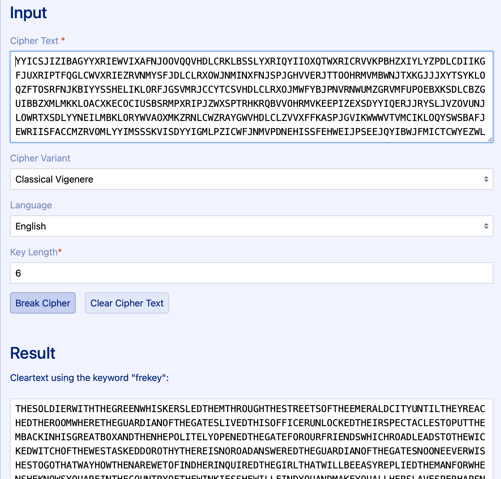
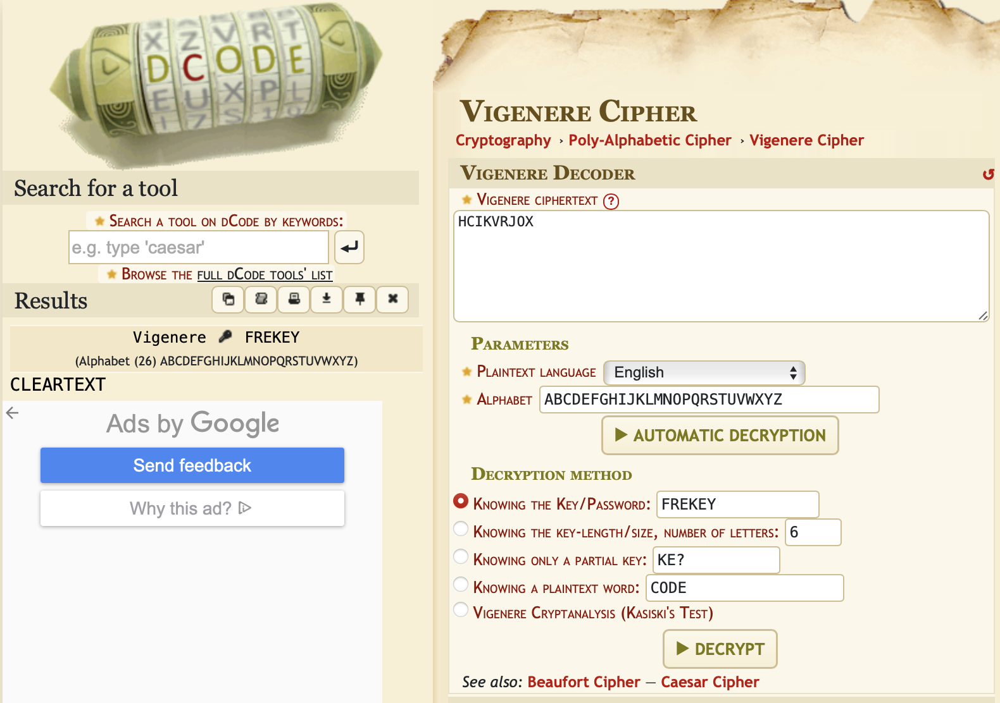

# Krypton 4


## Overview

-----------------
On the OverTheWire/Leviathan website, we are told how connecting to the bandit server as a specific user works.

Each user corresponds to a different level:
- Krypton0 -> Level 0
- Krypton1 -> Level 1
- ...
- Krypton33 -> Level 33

Each level is hiding a flag, which is used as the password for the following level. Meaning, one must solve `Level n` to play `Level n+1`.

We always start out connecting to the `krypton.labs.overthewire.org` server on `port 2231` for each level.
Again, the users on the server specifies the level. Each starting point is the same:

``` text
➜  ~  ssh krypton4@krypton.labs.overthewire.org -p 2231
                      _                     _              
                     | | ___ __ _   _ _ __ | |_ ___  _ __  
                     | |/ / '__| | | | '_ \| __/ _ \| '_ \ 
                     |   <| |  | |_| | |_) | || (_) | | | |
                     |_|\_\_|   \__, | .__/ \__\___/|_| |_|
                                |___/|_|                   

                      This is an OverTheWire game server. 
            More information on http://www.overthewire.org/wargames

krypton4@krypton.labs.overthewire.org's password: 
```

The password will always be the flag of the previous level. With the exception of Level 0, where the password is `KRYPTONISGREAT`.


## Connecting

--------------

We can establish a connection with the server via ssh, and using the password `BRUTE`:

``` text
➜  ~  ssh krypton4@krypton.labs.overthewire.org -p 2231
                      _                     _              
                     | | ___ __ _   _ _ __ | |_ ___  _ __  
                     | |/ / '__| | | | '_ \| __/ _ \| '_ \ 
                     |   <| |  | |_| | |_) | || (_) | | | |
                     |_|\_\_|   \__, | .__/ \__\___/|_| |_|
                                |___/|_|                   

                      This is an OverTheWire game server. 
            More information on http://www.overthewire.org/wargames

krypton4@krypton.labs.overthewire.org's password: BRUTE

      ,----..            ,----,          .---.
     /   /   \         ,/   .`|         /. ./|
    /   .     :      ,`   .'  :     .--'.  ' ;
   .   /   ;.  \   ;    ;     /    /__./ \ : |
  .   ;   /  ` ; .'___,/    ,' .--'.  '   \' .
  ;   |  ; \ ; | |    :     | /___/ \ |    ' '
  |   :  | ; | ' ;    |.';  ; ;   \  \;      :
  .   |  ' ' ' : `----'  |  |  \   ;  `      |
  '   ;  \; /  |     '   :  ;   .   \    .\  ;
   \   \  ',  /      |   |  '    \   \   ' \ |
    ;   :    /       '   :  |     :   '  |--"
     \   \ .'        ;   |.'       \   \ ;
  www. `---` ver     '---' he       '---" ire.org


Welcome to OverTheWire!

<snip>

  Enjoy your stay!

krypton4@gibson:~$ 
```

## Looking Around

--------------
We first start by looking around the home directory, as we have no idea what is going on. We will use the command `ls`,
which allows us to `list` the content of the current directory (or specified directory).


``` text
krypton4@bandit:~$ cd /krypton/krypton4
krypton4@bandit:/krypton/krypton4$ cat README 
Good job!

You more than likely used frequency analysis and some common sense
to solve that one.

So far we have worked with simple substitution ciphers.  They have
also been 'monoalphabetic', meaning using a fixed key, and 
giving a one to one mapping of plaintext (P) to ciphertext (C).
Another type of substitution cipher is referred to as 'polyalphabetic',
where one character of P may map to many, or all, possible ciphertext 
characters.

An example of a polyalphabetic cipher is called a Vigen?re Cipher.  It works
like this:

If we use the key(K)  'GOLD', and P = PROCEED MEETING AS AGREED, then "add"
P to K, we get C.  When adding, if we exceed 25, then we roll to 0 (modulo 26).


P     P R O C E   E D M E E   T I N G A   S A G R E   E D
K     G O L D G   O L D G O   L D G O L   D G O L D   G O

becomes:

P     15 17 14 2  4  4  3 12  4 4  19  8 13 6  0  18 0  6 17 4 4   3
K     6  14 11 3  6 14 11  3  6 14 11  3  6 14 11  3 6 14 11 3 6  14
C     21 5  25 5 10 18 14 15 10 18  4 11 19 20 11 21 6 20  2 8 10 17

So, we get a ciphertext of:

VFZFK SOPKS ELTUL VGUCH KR

This level is a Vigen?re Cipher.  You have intercepted two longer, english 
language messages.  You also have a key piece of information.  You know the 
key length!

For this exercise, the key length is 6.  The password to level five is in the usual
place, encrypted with the 6 letter key.

Have fun!
krypton4@bandit:/krypton/krypton4$ cat HINT
Frequency analysis will still work, but you need to analyse it
by "keylength".  Analysis of cipher text at position 1, 6, 12, etc
should reveal the 1st letter of the key, in this case.  Treat this as
6 different mono-alphabetic ciphers...

Persistence and some good guesses are the key!
```

OKay, after reading the hint, we know that our `KEY` is 6-chars long. This means we can split our texts into blocks
of 6, and do a frequency analysis on the character columns.

``` text
cat found* krypton5 | tr -d " " | fold -w 6 | cut -c 1 | sort | uniq -c | sort -nr
```

However, doing frequency analysis is very effective, but also very tedious in bash shell. A much much simpler solution
would be to look up a vinegere cipher solver online: **https://www.guballa.de/vigenere-solver**



After plugging in the `found1` text, we are told `frekey` is the key.



We then move to a different website: **https://www.dcode.fr/vigenere-cipher** to find convert the `krypton5` file
into the plaintext. 

And we find that the password for the next level is `CLEARTEXT`.


