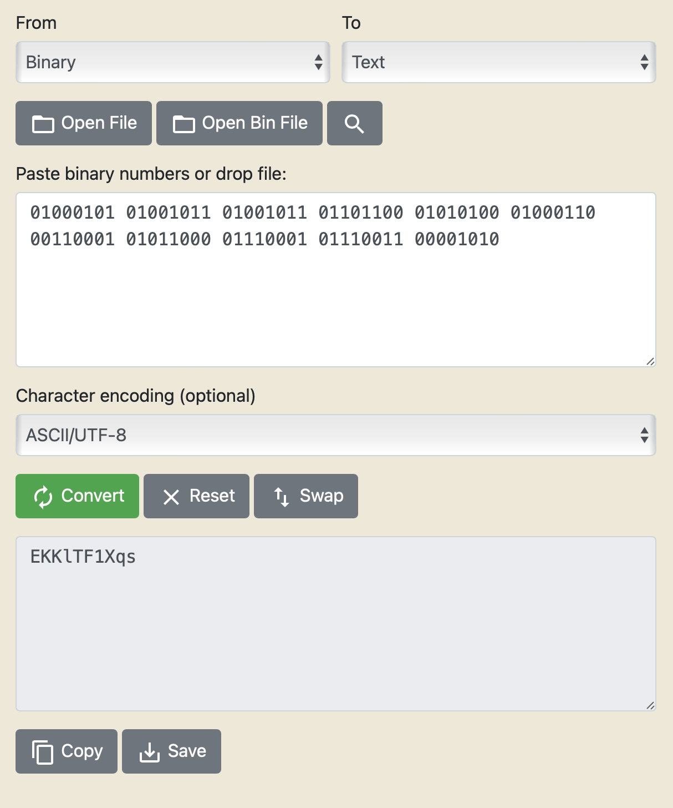

# Leviathan 4


## Overview

-----------------
On the OverTheWire/Leviathan website, we are told how connecting to the bandit server as a specific user works.

Each user corresponds to a different level:
- Leviathan0 -> Level 0
- Leviathan1 -> Level 1
- ...
- Leviathan33 -> Level 33

Each level is hiding a flag, which is used as the password for the following level. Meaning, one must solve `Level n` to play `Level n+1`.

We always start out connecting to the `leviathan.labs.overthewire.org` server on `port 2223` for each level.
Again, the users on the server specifies the level. Each starting point is the same:

``` text
➜  ~  ssh leviathan0@leviathan.labs.overthewire.org -p 2223          
                   _            _       _   _                        
                  | | _____   _(_) __ _| |_| |__   __ _ _ __         
                  | |/ _ \ \ / / |/ _` | __| '_ \ / _` | '_ \        
                  | |  __/\ V /| | (_| | |_| | | | (_| | | | |       
                  |_|\___| \_/ |_|\__,_|\__|_| |_|\__,_|_| |_|       
                                                                     
                                                                     
                      This is an OverTheWire game server.            
            More information on http://www.overthewire.org/wargames  
                                                                     
leviathan0@leviathan.labs.overthewire.org's password:     
```

The password will always be the flag of the previous level. With the exception of Level 0, where the password is `leviathan0`.


## Connecting

--------------

We can establish a connection with the server via ssh, and using the password `AgvropI4OA`:

``` text
➜  ~  ssh leviathan2@leviathan.labs.overthewire.org -p 2223
                   _            _       _   _                 
                  | | _____   _(_) __ _| |_| |__   __ _ _ __  
                  | |/ _ \ \ / / |/ _` | __| '_ \ / _` | '_ \ 
                  | |  __/\ V /| | (_| | |_| | | | (_| | | | |
                  |_|\___| \_/ |_|\__,_|\__|_| |_|\__,_|_| |_|
                                                              

                      This is an OverTheWire game server. 
            More information on http://www.overthewire.org/wargames

leviathan2@leviathan.labs.overthewire.org's password: AgvropI4OA

      ,----..            ,----,          .---.
     /   /   \         ,/   .`|         /. ./|
    /   .     :      ,`   .'  :     .--'.  ' ;
   .   /   ;.  \   ;    ;     /    /__./ \ : |
  .   ;   /  ` ; .'___,/    ,' .--'.  '   \' .
  ;   |  ; \ ; | |    :     | /___/ \ |    ' '
  |   :  | ; | ' ;    |.';  ; ;   \  \;      :
  .   |  ' ' ' : `----'  |  |  \   ;  `      |
  '   ;  \; /  |     '   :  ;   .   \    .\  ;
   \   \  ',  /      |   |  '    \   \   ' \ |
    ;   :    /       '   :  |     :   '  |--"
     \   \ .'        ;   |.'       \   \ ;
  www. `---` ver     '---' he       '---" ire.org


Welcome to OverTheWire!

<snip>

  Enjoy your stay!

leviathan2@gibson:~$ 
```

## Looking Around

--------------
We first start by looking around the home directory, as we have no idea what is going on. We will use the command `ls`,
which allows us to `list` the content of the current directory (or specified directory).


``` text
leviathan4@gibson:~$ ls
leviathan4@gibson:~$ ls -la
total 24
drwxr-xr-x  3 root root       4096 Apr 23 18:04 .
drwxr-xr-x 83 root root       4096 Apr 23 18:06 ..
-rw-r--r--  1 root root        220 Jan  6  2022 .bash_logout
-rw-r--r--  1 root root       3771 Jan  6  2022 .bashrc
-rw-r--r--  1 root root        807 Jan  6  2022 .profile
dr-xr-x---  2 root leviathan4 4096 Apr 23 18:04 .trash
leviathan4@gibson:~$ file .trash/
.trash/: directory
leviathan4@gibson:~$ cd .trash
leviathan4@gibson:~/.trash$ ls
bin
leviathan4@gibson:~/.trash$ ./bin
01000101 01001011 01001011 01101100 01010100 01000110 00110001 01011000 01110001 01110011 00001010 
```

Hmm alright. We got some binary strings. We could try to figure out how to convert this to `ascii` text in the terminal
or we can go to a website and have it convert the binary for us.




BOOM. We got another flag. `EKKlTF1Xqs`


